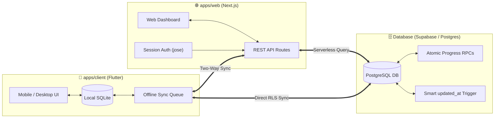

<div align="center">


<br/>
<br/>

[](https://github.com/Tvastr-ops/reading-tracker/releases/tag/v1.7.0)
[](https://nextjs.org/)
[](https://flutter.dev/)
[](https://supabase.com/)
[](https://pnpm.io/)
[](./LICENSE)

<br/>

> **Paperback** is a privacy-first, self-hosted reading tracker built for meticulous book lovers and serial fiction enthusiasts. It features a tactile editorial paper aesthetic, advanced multi-tier progress tracking (Volume ➔ Chapter), full offline-first mobile sync, and detailed reading velocity analytics.

</div>

---

## 🏛️ Monorepo Architecture

This repository is structured as an integrated `pnpm` monorepo containing the web application, cross-platform client app, and database migrations:

```text
reading-tracker/
├── 🌐 apps/web/        # Next.js 16 App Router, React 19, Tailwind CSS (Web Dashboard & REST API)
├── 📱 apps/client/     # Flutter Multi-Platform Client (Android, Windows, Linux, Web)
├── 🗄️ supabase/        # Versioned PostgreSQL migrations, RLS policies & RPC functions
└── 📄 DEPLOYMENT_GUIDE # Complete end-to-end self-hosting & cloud deployment guide
```

---

## 📦 Workspace Packages

| Package | Technology Stack | Primary Purpose |
| :--- | :--- | :--- |
| [`apps/web`](./apps/web) | **Next.js 16**, React 19, Tailwind CSS v4, Biome | Full-featured web dashboard, serverless REST API endpoints, PWA support, and authentication gating. |
| [`apps/client`](./apps/client) | **Flutter 3.19+**, Dart 3, SQLite (`sqflite`), Material 3 | Native offline-first companion app for Android APK, Windows `.exe`, Linux, and Web with 16 thematic color palettes. |
| [`supabase`](./supabase) | **PostgreSQL**, Row Level Security (RLS), PL/pgSQL | Chronologically sorted database migrations (`v02`–`v11`), atomic progress logging RPCs, and automated triggers. |

---

## ⚡ Core Ecosystem Capabilities

### 📚 1. Advanced Multi-Tier Progression Engine
* **Flexible Unit Types**: Track progress across **Pages**, **Chapters**, **Volumes**, or **Words**.
* **Volume ➔ Chapter Hierarchy**: Designed specifically for Light Novels and Web Serials with support for continuous progression or per-volume chapter resets.
* **Ongoing Serial Tracking**: Handles ongoing works with dynamic *"Caught Up"* and *"Chapters Behind"* indicators.

### 🔄 2. Dual Sync & Offline-First Architecture
* **Direct Supabase Cloud Sync**: Serverless PostgreSQL sync with Row Level Security.
* **Self-Hosted REST API**: Sync directly with your private Next.js deployment.
* **Local-First SQLite Engine**: Full offline database on mobile and desktop devices with automatic sync queueing and conflict resolution.

### 📊 3. Reading Analytics & Pace Calculation
* **Live Reading Velocity**: Real-time reading pace calculation (e.g. `14.2 ch/day` or `45 pgs/day`).
* **Pace-to-Goal Countdown**: Smart forecasting for annual reading goals and estimated completion dates.
* **Rating Distribution & Monthly Charts**: Half-star and decimal rating distributions with monthly reading volume summaries.

### 🎨 4. Tactile Editorial Paper Aesthetic
* **High-Contrast Editorial Styling**: Bold typographic hierarchy inspired by vintage paperbacks and physical bookplates.
* **16 Thematic Color Schemes**: Symmetrical Light/Dark pairs (Classic Paperback, Charcoal Ledger, Manga Inkpaper, Manga Noir OLED, Matcha & Washi, Cyanotype Blueprint, Crumpled Kraft, and more).

---

## 🛠️ Data Flow Diagram



---

## 🚀 Monorepo Development

### Prerequisites
* **Node.js** `>= 20.0.0`
* **pnpm** `>= 9.0.0`
* **Flutter SDK** `>= 3.19.0` (for mobile/desktop development)

### Quick Start

```bash
# 1. Clone the repository
git clone https://github.com/Tvastr-ops/reading-tracker.git
cd reading-tracker

# 2. Install workspace dependencies
pnpm install

# 3. Launch the Web Application (http://localhost:3000)
pnpm run dev:web

# 4. Launch the Flutter Client Application
pnpm run dev:client
# Or: cd apps/client && flutter run
```

> **💡 Package Manager Note**: The root workspace is orchestrated with **`pnpm`** (`pnpm-workspace.yaml`). If developing exclusively inside the [`apps/web`](./apps/web) subfolder, you may also use **`npm`**, **`yarn`**, or **`bun`** directly.

### Workspace Commands

| Command | Action |
| :--- | :--- |
| `pnpm run dev:web` | Starts Next.js development server with Turbopack |
| `pnpm run build:web` | Builds the production Next.js static and serverless bundles |
| `pnpm run test:web` | Runs the 29 web progression and integration test suite |
| `pnpm run lint` | Runs Biome linter across all workspace TypeScript and JS files |
| `pnpm run format` | Auto-formats code according to the repository styleguide |

---

## 📖 Deployment & Self-Hosting

Detailed instructions for deploying to **Vercel**, configuring **Supabase**, generating API keys, and compiling native Android APKs can be found in the:

👉 **[Deployment & Self-Hosting Guide](./doc/how-to/DeployVercelSupabase.md)**

---

## 📄 License

This project is open-source software licensed under the **[MIT License](./LICENSE)**.
