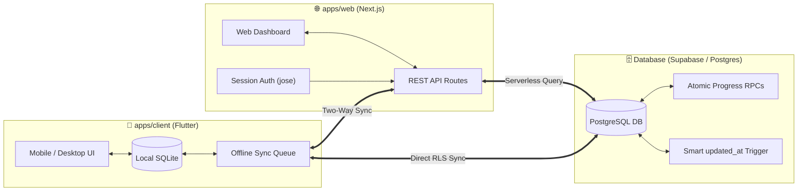

<div align="center">


<br/>
<br/>

[](https://github.com/Tvastr-ops/reading-tracker/releases)
[](https://nextjs.org/)
[](https://flutter.dev/)
[](https://supabase.com/)
[](https://pnpm.io/)
[](./LICENSE)

<br/>

> **Paperback** is a privacy-first, self-hosted reading tracker built for meticulous book lovers and serial fiction enthusiasts. It features a tactile editorial paper aesthetic, advanced multi-tier progress tracking (Volume ➔ Chapter), full offline-first mobile sync, and detailed reading velocity analytics.

</div>

---

## 🏛️ Repository Layout

This monorepo contains the web dashboard, companion client app, and database migrations:

```text
reading-tracker/
├── apps/web/        # Next.js 16 App Router, React 19, Tailwind CSS (Web Dashboard & API)
├── apps/client/     # Flutter Client for Android, Windows, Linux, and Web
├── supabase/        # PostgreSQL migrations (v02–v11), RLS policies, and triggers
└── doc/             # Technical guides, API references, and architecture docs
```

---

## 📦 Packages

| Package | Stack | What it does |
| :--- | :--- | :--- |
| [`apps/web`](./apps/web) | Next.js 16, React 19, Tailwind CSS, Biome | Web dashboard, serverless REST API, and session auth. |
| [`apps/client`](./apps/client) | Flutter 3.19+, Dart 3, SQLite (`sqflite`) | Offline-first native client with 16 thematic color palettes. |
| [`supabase`](./supabase) | PostgreSQL, PL/pgSQL | Versioned migrations, atomic progress RPCs, and smart triggers. |

---

## ✨ Features

### Multi-Tier Progression for Complex Reads
* **Flexible Units**: Track in Pages, Chapters, Volumes, or Words.
* **Volume ➔ Chapter Hierarchy**: Built specifically for Light Novels and Web Serials, supporting continuous chapter counts or volume-based resets.
* **Ongoing Serialization Tracker**: Live "Caught Up" and "X chapters behind" indicators for ongoing web fiction and manga.

### Offline-First Dual Sync
* **Local SQLite Database**: Full offline functionality on mobile and desktop. Updates save instantly and sync when you're back online.
* **Two Sync Modes**: Connect directly to Supabase via RLS, or sync through your self-hosted Next.js web server.
* **Smart Favorite Preservation**: Toggling favorite status never scrambles your "Recently Read" shelf order.

### Reading Velocity & Goal Forecasting
* **Live Pace Calculations**: Real-time reading speed tracking (e.g. `14 chapters/week`).
* **Goal Countdown**: Dynamic monthly pacing to help hit annual reading targets.
* **16 Thematic Paper Palettes**: 8 symmetrical light/dark theme pairs inspired by vintage paperbacks, Japanese washi, drafting vellum, and OLED manga noir.

---

## 🛠️ Data Flow Diagram



---

## 🚀 Monorepo Development

### Prerequisites
* **Node.js** `>= 20.0.0`
* **pnpm**, **npm**, or **bun**
* **Flutter SDK** `>= 3.19.0` (for mobile/desktop development)

### Quick Start

```bash
# 1. Clone the repository
git clone https://github.com/Tvastr-ops/reading-tracker.git
cd reading-tracker

# 2. Install workspace dependencies (using your preferred package manager)
pnpm install   # Or: bun install / npm install

# 3. Launch the Web Application (http://localhost:3000)
pnpm run dev:web   # Or: bun --filter web dev / npm run dev --workspace=web

# 4. Launch the Flutter Client Application
pnpm run dev:client
# Or: cd apps/client && flutter run
```

### Workspace Commands

| Command | Action |
| :--- | :--- |
| `pnpm run dev:web` | Starts Next.js development server with Turbopack |
| `pnpm run build:web` | Builds the production Next.js static and serverless bundles |
| `pnpm run test:web` | Runs the 29 web progression and integration test suite |
| `pnpm run lint` | Runs Biome linter across all workspace TypeScript and JS files |
| `pnpm run format` | Auto-formats code according to the repository styleguide |

---

## 📖 Deployment & Self-Hosting

Detailed instructions for deploying to **Vercel**, configuring **Supabase**, generating API keys, and compiling native Android APKs can be found in the:

👉 **[Deployment & Self-Hosting Guide](./doc/how-to/DeployVercelSupabase.md)**

---

## 📄 License

This project is open-source software licensed under the **[MIT License](./LICENSE)**.
