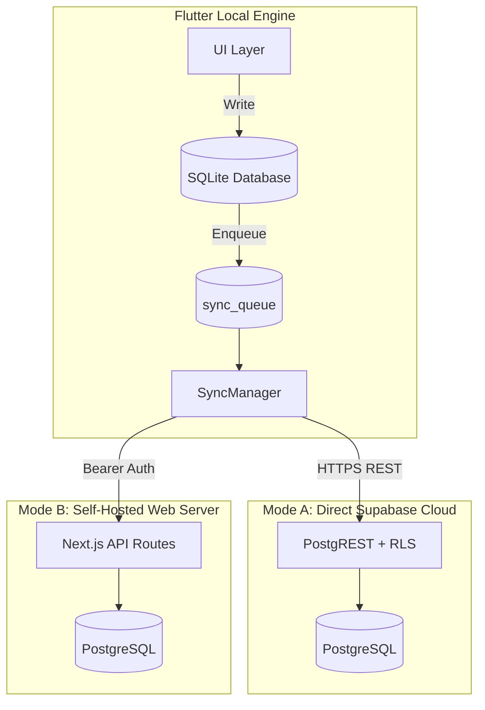

# Sync Architecture

Architectural overview of the offline-first synchronization engine and conflict resolution model.

---

## Local-First Design

The Flutter client uses a local-first SQLite architecture to guarantee full offline usability:

1. All library mutations (create, progress advancement, status edit, favorite toggle) write synchronously to local SQLite.
2. The UI updates immediately without awaiting network responses.
3. Mutations are queued in a local `sync_queue` table.
4. Background `SyncManager` processes the queue against the remote backend when network connectivity is available.

---

## Topology

### Direct Supabase Sync (Mode A)
* Communicates directly with Supabase via PostgREST and the public `anon` key.
* Access control is enforced via PostgreSQL Row Level Security (RLS).

### Web REST API Sync (Mode B)
* Communicates with Next.js `/api/books` and `/api/logs` routes using the `APP_PASSWORD`.
* Ideal for unified self-hosted deployments.

---

## Conflict Resolution

* **Timestamp Ordering**: All tables maintain UTC `updated_at` timestamps.
* **Last-Write-Wins (LWW)**: During bidirectional reconciliation, records with newer `updated_at` timestamps overwrite older local or remote state.
* **Favorite Preservation**: Toggling `is_favorite` preserves the existing `updated_at` timestamp, ensuring bookmark changes do not trigger artificial synchronization conflicts or displace recently active books on other clients.
