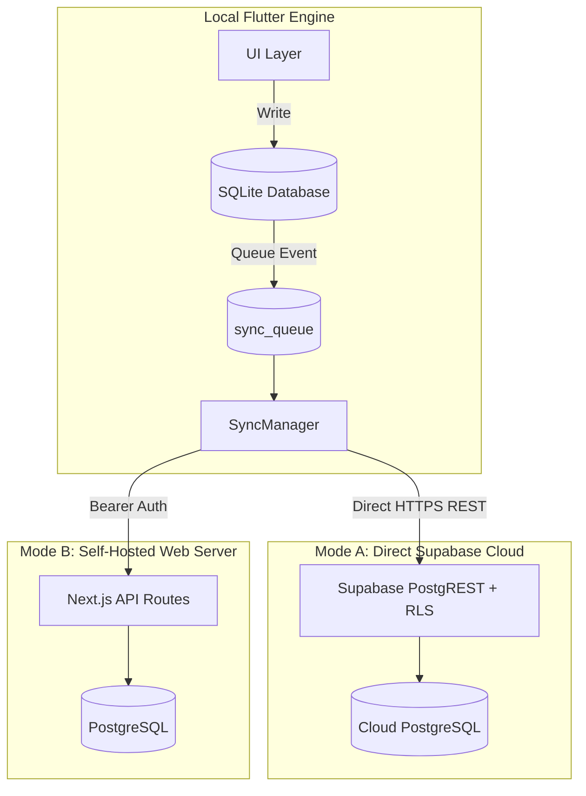

# Architecture & Explanation: Offline-First Dual Sync Engine

This document explains the technical architecture, design trade-offs, and conflict resolution strategy behind the Paperback offline-first synchronization engine.

---

## 🎯 The Core Philosophy: Local-First

Reading often takes place in airplanes, subways, and places with intermittent connectivity. A reading tracker should never block user interaction with a loading spinner or fail because of network timeouts.

Therefore, the Flutter client uses a **Local-First Architecture**:
1. Every book creation, reading log advancement, status change, and favorite toggle writes **immediately to on-device SQLite**.
2. The UI renders instantly with zero latency.
3. Mutations are simultaneously pushed to an asynchronous `sync_queue` table.
4. The background `SyncManager` drains the queue to the cloud when a network connection is available.

---

## 🔄 Dual Synchronization Topologies

Paperback supports two distinct synchronization backends through an abstracted provider interface (`SyncProvider`):

### Mode A: Direct Supabase Cloud Sync
* Designed for serverless self-hosters who don't want to run a web server.
* The Flutter app communicates directly with Supabase via the public `anon` key, enforced by Row Level Security policies.

### Mode B: Self-Hosted REST API Sync
* Designed for users running their private Next.js web application.
* The Flutter app communicates directly with the Next.js `/api/books` and `/api/logs` endpoints using the `APP_PASSWORD`.

---

## ⚔️ Conflict Resolution: Last-Write-Wins (LWW)

When syncing between multiple devices (e.g. phone, tablet, and web dashboard):
1. Every row carries an authoritative `updated_at` UTC timestamp.
2. When downloading remote records, if `remote.updated_at > local.updated_at`, the local row is updated.
3. If local changes exist in `sync_queue` that have not reached the server yet, local mutations take precedence and push to the server on the next sync cycle.
4. Toggling the `is_favorite` flag intentionally does not alter `updated_at`, ensuring that favoriting a book on one device does not trigger an artificial conflict or reorder the shelf on other devices.
